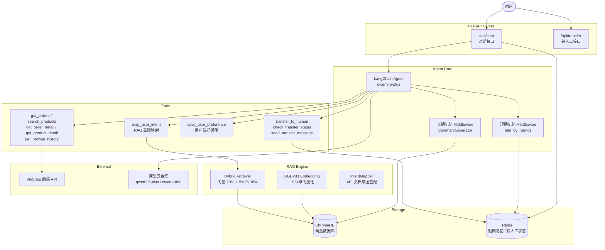
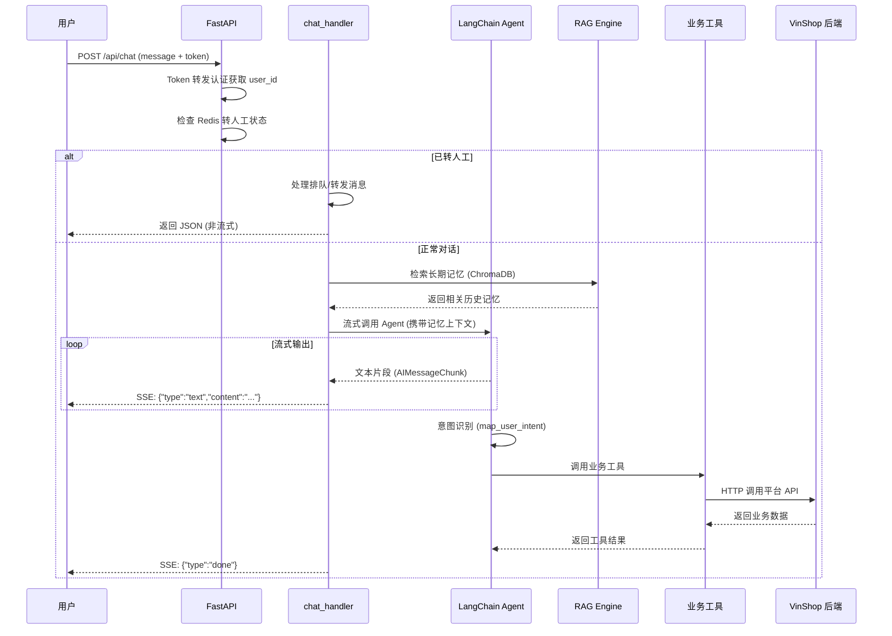
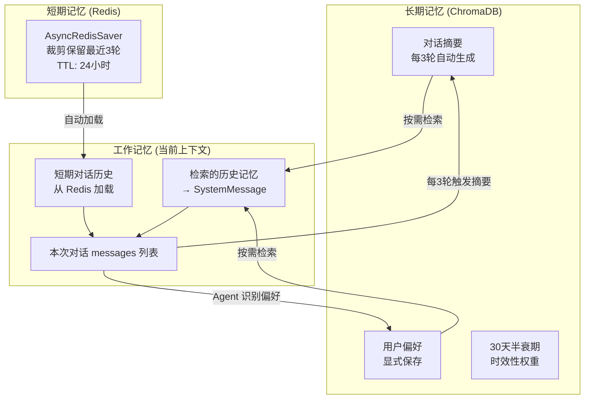

<div align="center">

# CustomerService Agent

### 智能客服 Agent 系统

基于 LangChain / LangGraph 构建的智能客服系统，为 VinShop 购物平台提供 AI 驱动的客户服务能力。


</div>

---

## 功能特性

| 功能 | 说明 |
|------|------|
| 流式输出 | SSE 流式返回 Agent 回复，实时响应用户 |
| 订单查询 | 通过自然语言查询订单列表和订单详情 |
| 商品搜索 | 支持关键词搜索、价格区间筛选、排序 |
| 商品详情 | 获取商品规格、库存、价格等详细信息 |
| 浏览历史 | 查看用户历史浏览记录 |
| 用户偏好 | 自动识别并保存用户偏好（品牌、颜色、预算等） |
| 转人工客服 | AI 客服到人工客服的无缝转接（排队、留言、会话管理） |
| 多轮对话 | 支持有上下文的多轮对话 |
| 三层记忆 | 短期记忆 + 长期记忆 + 工作记忆，实现上下文延续与历史回忆 |
| RAG 意图识别 | 通过 RAG 技术将用户自然语言映射对应的 API 端点 |

## 架构总览



## 工作流程



## 三层记忆架构



## 技术栈

| 类别 | 技术 | 说明 |
|------|------|------|
| Web 框架 | FastAPI | 异步 API 服务 |
| LLM 框架 | LangChain + LangGraph | Agent 编排与工具调用 |
| LLM 模型 | 阿里云百炼 qwen3.5-plus | 主推理模型 |
| 摘要模型 | 阿里云百炼 qwen-turbo | 轻量级对话摘要 |
| 向量数据库 | ChromaDB | 本地持久化存储 |
| Embedding | BGE-M3 (BAAI) | 1024 维向量化，本地加载 |
| 短期记忆 | Redis (AsyncRedisSaver) | 对话历史，24 小时 TTL |
| 中文分词 | jieba | BM25 关键词检索 |
| 关键词检索 | rank-bm25 | BM25Okapi 算法 |
| HTTP 客户端 | httpx | 异步 API 调用，指数退避重试 |
| 包管理 | uv | 现代化 Python 包管理 |

## 项目结构

```
CustomerService_Agent/
├── app/
│   ├── main.py                     # FastAPI 入口 + 生命周期管理
│   ├── agents/
│   │   └── agent.py                # Agent 创建、System Prompt、Middleware
│   ├── core/
│   │   ├── chat_handler.py         # 业务编排层（转人工 + 流式Agent调用）
│   │   ├── rag.py                  # ChromaDB 向量数据库封装（单例）
│   │   ├── embedding.py            # BGE-M3 向量化服务（单例）
│   │   ├── retriever.py            # 混合检索器（向量 + BM25）
│   │   ├── updater.py              # 向量库更新器
│   │   └── intent.py               # 意图映射模块
│   ├── memory/
│   │   └── long_term.py            # 长期记忆管理器
│   ├── routers/
│   │   ├── chat.py                 # /api/chat 对话接口
│   │   └── transfer.py             # /api/transfer 转人工接口
│   ├── schemas/
│   │   ├── chat.py                 # ChatRequest / ChatResponse
│   │   ├── tools.py                # ProductSearchParams
│   │   └── transfer.py             # TransferStatusUpdateRequest
│   ├── tools/
│   │   ├── rag_tools.py            # RAG 意图映射工具
│   │   ├── api_tools.py            # 业务工具（订单/商品/浏览历史）
│   │   ├── memory_tools.py         # 用户偏好保存工具
│   │   └── transfer_tools.py       # 转人工工具
│   └── utils/
│       ├── api_caller.py           # 通用 HTTP 调用（httpx + 重试）
│       ├── auth.py                 # Token 转发认证
│       ├── message_utils.py        # 工具函数（记忆检索/消息构建/会话ID提取）
│       ├── summary.py              # 对话摘要生成器
│       └── transfer_status.py      # Redis 转人工状态管理
├── data/
│   └── api_docs.json               # API 文档数据（供 RAG 意图映射）
├── vectordb/                       # ChromaDB 持久化数据
├── langgraph.json                  # LangGraph 部署配置
├── pyproject.toml                  # 项目依赖配置
└── .env                            # 环境变量（不提交到 Git）
```

## 环境要求

- Python >= 3.14
- Redis（运行在 `localhost:6379`）
- BGE-M3 模型文件（本地加载路径：`D:/models/bge-m3`）
- VinShop 购物平台后端 API

## 快速开始

### 1. 克隆项目

```bash
git clone https://github.com/VingerChan/CustomerService_Agent.git
cd CustomerService_Agent
```

### 2. 安装依赖

```bash
# 推荐使用 uv
uv sync

# 或 pip
pip install -e .
```

### 3. 配置环境变量

复制 `.env.example` 为 `.env` 并填写配置：

```env
# 阿里云百炼 API
DASHSCOPE_API_KEY=your_api_key
DASHSCOPE_BASE_URL=https://dashscope.aliyuncs.com/compatible-mode/v1

# 平台后端 API
BASE_URL=http://your-shop-api-host:port
USER_API=/api/your-api-endpoint
TRANSFER_MESSAGE=/api/your-transfer-message-endpoint
TRANSFER_QUEUE=/api/your-transfer-queue-endpoint/{session_id}

# Redis
REDIS_URL=redis://localhost:6379/0
REDIS_TRANSFER_STATUS=redis://localhost:6379/1

# ChromaDB
CHROMADB_PATH=./vectordb

# LangSmith（可选，用于追踪）
LANGSMITH_API_KEY=your_langsmith_key
LANGSMITH_TRACING=true
```

### 4. 启动服务

```bash
# 方式 1：LangGraph CLI（推荐）
langgraph dev

# 方式 2：uvicorn
uvicorn app.main:app --host 0.0.0.0 --port 8000

# 方式 3：项目脚本
customerservice-agent
```

服务启动后，自动加载 API 文档到向量数据库，输出 `已加载 10 条API文档到向量数据库` 表示成功。

## API 文档

### 对话接口

```
POST /api/chat
```

**请求体：**

| 字段 | 类型 | 必填 | 说明 |
|------|------|------|------|
| message | string | 是 | 用户输入的消息 |
| token | string | 是 | 用户认证 token |

**响应体（正常对话 — SSE 流式）：**

返回 `Content-Type: text/event-stream`，每个事件以 `data: ` 开头，JSON 格式：

| type 字段 | 说明 |
|-----------|------|
| text | Agent 回复文本片段，content 为文本内容 |
| transfer | 转人工触发，status 为 pending，session_id 为会话 ID |
| done | 流结束信号 |

**响应体（转人工拦截时 — JSON）：**

当用户已处于排队/人工服务状态时，直接返回 JSON（非流式）：

| 字段 | 类型 | 说明 |
|------|------|------|
| reply | string | 回复内容 |
| session_id | string | 会话 ID（user_id） |
| transfer_status | string | 转人工状态：pending / active |
| transfer_session_id | string | 转人工会话 ID |

**SSE 流式示例：**

```bash
curl -X POST http://localhost:8000/api/chat \
  -H "Content-Type: application/json" \
  -d '{"message": "帮我查一下订单", "token": "Bearer <user_token>"}'
```

```
data: {"type": "text", "content": "您好"}
data: {"type": "text", "content": "，正在为您查询订单..."}
data: {"type": "done"}
```

**前端接收示例：**

```javascript
const response = await fetch('/api/chat', {
  method: 'POST',
  headers: { 'Content-Type': 'application/json' },
  body: JSON.stringify({ message: '帮我查一下订单', token: 'xxx' })
});

const reader = response.body.getReader();
const decoder = new TextDecoder();

while (true) {
  const { done, value } = await reader.read();
  if (done) break;
  const text = decoder.decode(value, { stream: true });
  for (const line of text.split('\n')) {
    if (line.startsWith('data: ')) {
      const data = JSON.parse(line.slice(6));
      if (data.type === 'text') appendToChatBox(data.content);
      if (data.type === 'transfer') showTransferPrompt(data.session_id);
      if (data.type === 'done') reader.cancel();
    }
  }
}
```

### 转人工状态更新

```
POST /api/transfer/status-update
Authorization: Bearer <token>
```

**请求体：**

| 字段 | 类型 | 必填 | 说明 |
|------|------|------|------|
| session_id | string | 是 | 转人工会话 ID |
| status | string | 是 | 状态：human_active / session_completed |

**示例：**

```bash
curl -X POST http://localhost:8000/api/transfer/status-update \
  -H "Authorization: Bearer <token>" \
  -H "Content-Type: application/json" \
  -d '{"session_id": "hs_xxx", "status": "session_completed"}'
```

### 健康检查

```
GET /
```

```json
{"message": "智能客服Agent运行中"}
```

## 核心设计

### Token 转发认证

Agent 服务不解码用户 Token，仅做转发。调用 VinShop 后端 API 时携带原始 Token，由后端验证用户身份，确保安全性。

### 三层记忆架构

- **短期记忆**：Redis AsyncRedisSaver，裁剪保留最近 3 轮对话历史，24 小时自动过期
- **长期记忆**：ChromaDB `user_memories` 集合，保存对话摘要（每 3 轮自动生成）和用户偏好，30 天半衰期时效性权重
- **工作记忆**：每次请求时从长期记忆中按需检索相关信息，以 SystemMessage 注入当前对话上下文供 LLM 使用

### 混合检索

RAG 引擎同时使用向量语义检索（权重 70%）和 BM25 关键词检索（权重 30%），通过 jieba 中文分词提升关键词检索效果。两种检索并发执行，融合得分后返回 Top-N。

### 异步优先

ChromaDB 的同步 API 通过 `asyncio.to_thread` 包装为异步调用，避免阻塞 FastAPI 事件循环。

### 中间件机制

- **trim_message_middleware**：按轮次裁剪对话历史，保留最近 3 轮，控制 Token 消耗
- **LongTermMemoryMiddleware**：每 3 轮对话自动生成摘要并保存到 ChromaDB，后台异步执行不阻塞主流程

## License

MIT
